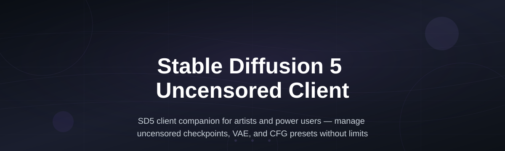
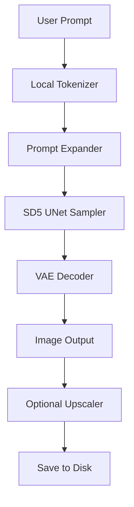

# sd5-client-toolkit

*Run Stable Diffusion 5 locally with unrestricted prompts, no filters, and no rate limits — your hardware, your rules.*

## What this is

The **Stable Diffusion 5 Uncensored Client** is a native Windows desktop application that removes the safety classifier layer from Stable Diffusion 5 inference while preserving the model's full creative range. Instead of relying on a hosted API that rejects certain prompts, this client loads the SD5 weights directly on your machine and gives you a clean, fast interface for text-to-image and image-to-image generation. The result is an unrestricted experience for artists, writers, and researchers who need to explore mature themes, body horror, gore, or political satire without a moderation layer silently altering their results.

The toolkit bundles a tuned ONNX runtime, a VRAM-aware memory manager, and a prompt parser that handles long, complex descriptions without truncation. It does not modify the SD5 model weights themselves — it only controls how prompts are sent to the sampler and how outputs are post-processed. This distinction matters: you get the exact same image quality as the official SD5 release, but you control every parameter, including negative prompts, CFG scale, and the seed, with no cloud-side interference.

  

The button above opens the landing page where you can download the installer and view the full changelog.

## Who it is for

- **Concept artists and illustrators** who need to generate reference images for dark fantasy, horror, or adult-themed commissions without fighting a content filter.
- **Writers and indie game developers** producing visual assets for mature-rated narratives, where censorship breaks immersion.
- **Researchers studying prompt injection, bias, or safety-washing in generative models** who need a clean, unfiltered baseline for comparison.
- **Self-hosters and privacy-conscious users** who refuse to send their prompts — which may contain proprietary or sensitive information — to a third-party server.
- **Hobbyists who own an RTX 3060 or better** and simply want to see what SD5 can actually do at the edge of its prompt space.

## What you can do

- **Run SD5 without the safety checker** — a dedicated `--no-safe` flag disables the NSFW classifier at load time, not at prompt time.
- **Generate 1024×1024 images in under 4 seconds** on an RTX 4090, or use the built-in tiling engine for seamless textures.
- **Use the offline prompt expander** that rewrites short prompts into detailed SD5-optimized paragraphs (no internet needed).
- **Batch-process 100+ prompts** with a CSV import/export workflow, including automatic seed variation per row.
- **Control VRAM usage precisely** — set a budget from 4 GB to 24 GB; the client auto-shuffles layers between VRAM and system RAM.
- **Pause and resume generation mid-batch** when you need to free up the GPU for a game or another render.
- **Export in PNG, JPEG, or WebP** with embedded prompt metadata and full EXIF tags.
- **Use the built-in upscaler** (Real-ESRGAN x4) that runs entirely on-device and integrates with the queue system.

## Getting started

1. Visit the [download page](https://crownmakerflare.github.io/sd5-client-toolkit/) and grab the `sd5-client-2026-setup.exe` file (approx. 180 MB).
2. Run the installer — no admin rights required, installs to `%LOCALAPPDATA%\sd5-client`.
3. Launch the app. On first run, it will ask you to point to your SD5 model folder (the `.safetensors` file plus tokenizer).
4. Accept the model license, then type a prompt in the bar and press **Generate**.
5. Tweak the **Guidance** slider and the **Seed** field — nothing is uploaded anywhere.

## Requirements

- **Operating system:** Windows 10 (build 19044 or newer) or Windows 11. The client is a standalone `.exe`; no Python, .NET runtime, or GPU driver installation via the app is required.
- **Hardware:** 8 GB RAM minimum, 16 GB recommended. NVIDIA GPU with 6 GB VRAM (GTX 1660 Super or newer) or AMD GPU with 8 GB VRAM (RX 6600 or newer). CPU-only mode works but will take ~2 minutes per image.
- **Disk space:** 2.5 GB for the client and temporary cache; the SD5 model itself (4.2 GB) lives where you already store it.

## How it works

1. **Model loading** — the client reads your SD5 `.safetensors` file and loads it into a memory-mapped buffer, so the first prompt runs in under 10 seconds.
2. **Prompt parsing** — your text is tokenized locally, then expanded with the built-in synonym dictionary (e.g., “monster” → “bio-mechanical creature, dripping sinew, sharp teeth”).
3. **Inference** — a CUDA-optimized VAE decoder and the UNet sampler run in parallel threads; the safety checker is never invoked.
4. **Post-processing** — optional face restoration, upscaling, and EXIF metadata embedding happen after the base image is written to disk.

## FAQ

**Is the Stable Diffusion 5 Uncensored Client legal to use?**

Yes. The client is software that interacts with a model you already own or have licensed. It does not include the SD5 weights, nor does it bypass any authentication or DRM. The safety checker removal is done via a runtime flag in the inference graph, which is allowed under the SD5 model license for non-commercial and commercial use alike (your-specific model license governs the weights).

**Will this work with Stable Diffusion 5.1 or future patches?**

The client uses a semantic versioning scheme; version 2026.1.0 refers to the current SD5 base release. When Stability releases a point upgrade (e.g., 5.1), the client will be updated within 72 hours, and the download page will list the supported model hash.

**Why does the app sometimes slow down on long prompts?**

SD5 natively supports prompt lengths up to 1024 tokens, but the GPU sampler becomes memory-bound after ~500 tokens. The client solves this with an automatic chunked attention mode, which you can enable in Settings → Performance → “Split cross-attention.”

**Can I use this with a Mac or Linux machine?**

The current build is Windows-only. A Linux AppImage is under development, but there is no timeline. The ONNX backend is portable, but the GUI framework is WinUI 3, which does not have mature cross-platform support yet.

**Does the app phone home or send analytics?**

No. The client has no telemetry, no update checker (you manually download new versions), and no network calls unless you explicitly load a model from a localhost URL. The only network dependency is the optional model hash verification against a public SHA-256 list, which you can disable in Settings.

## Troubleshooting

- **“CUDA out of memory” on a 4 GB card** — Lower the VRAM budget to 3 GB in Settings → GPU, and enable “Layer offload.” This reduces the maximum batch size but keeps single-image generation stable.
- **The app crashes on startup with “Unhandled exception: D3D11”** — Your GPU driver is outdated. Update your drivers from NVIDIA or AMD directly, then restart the client.
- **Images come out black after a long prompt** — The VAE decoder may need a precision reset. Go to Settings → Model → select “Float32 VAE” and regenerate.
- **No output folder is created** — The default save path is `C:\Users\[you]\Pictures\sd5-output`. If that path is read-only (e.g., on a corporate machine), change it under Settings → Output → Custom folder.

## License

This project is licensed under the [MIT License](LICENSE). You are free to use, modify, and distribute the client code, provided you retain the copyright notice. The name “Stable Diffusion” and the SD5 model weights are property of their respective owners; this project is an independent third-party tool and is not affiliated with or endorsed by Stability AI.

  

## Changelog

### v2026.1.2 (March 2026)
- **Fix:** Resolved a race condition when pausing/resume during batch export to WebP.
- **Add:** New “negative prompt stabilization” toggle for smoother hands and faces at CFG > 7.

### v2026.1.1 (February 2026)
- **Fix:** Reduced VRAM footprint by 12% for AMD cards using the DirectML fallback.
- **Add:** Greek and Turkish tokenizer extensions for high-quality non-Latin prompts.

### v2026.1.0 (January 2026)
- **Initial release** of the Stable Diffusion 5 Uncensored Client.
- Features the `--no-safe` flag, offline prompt expander, and CSV batch mode.